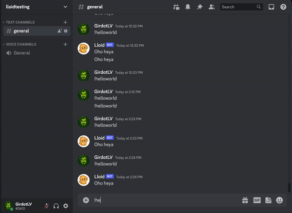

# girbot

girbot is a modular discord chatbot in python.

I got tired of rebuilding the docker containers for my chat bots when I was just
adding or editing commands, so I designed this package to run inside a docker
container and load command modules at runtime via an environment variable.

See [Getting started with docker](#getting-started-with-docker) for how to run girbot in this way.

## Getting started

Below are the installation instructions to install and run girbot w/ the
[helloworld command module](https://github.com/girdot/girbot-helloworld), which exposes a single command: `helloworld`.
Recommended to use a python virtual environment.

```
# Set up your virtual environment.  Optional, but recommended
python3 -m venv env
source env/bin/activate

# Install girbot w/ pip.  Proper pypy package coming someday, for now
# just install from the repo
pip install git+https://github.com/girdot/girbot

# Then, define your discord bot token.  Refer to the discord developer portal
# for information about how to generate one.
export DISCORD_BOT_TOKEN=<your-token-here>

# Now, install your command modules.  For this example we're going to install
# the 'helloworld' module.  Again, proper pypy packages coming someday
pip install git+https://github.com/girdot/girbot-helloworld

# Now simply run the bot
girbot
```

Now if your bot is configured properly in the discord developer portal and
invited to your server, you should see it come online in the members list.  Now
it's time to test it out.  Simply type "!helloworld" in the chat and the bot
should respond!



## Getting started with docker

Below are the instructions to run girbot w/ the helloworld command module in a
docker container.  Image is available on [dockerhub](https://hub.docker.com/repository/docker/girdot/girbot/general) and should pull automatically

```
docker run -e DISCORD_BOT_TOKEN=<your-token-here> -e MODULE_REPOS="girdot/girbot-helloworld" -d girdot/girbot:latest
```

The `MODULE_REPOS` env variable is a comma separated list of command modules to
load from github.

## Writing your own modules

Use the helloworld command module as a template.  Module package names must be
prefixed with `girbot-` to be properly loaded by the bot.  Be sure to add any
module dependencies to the setup.py for your module
